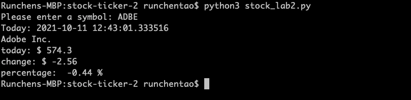

# stock-ticker-2

A simple python script that takes a stock symbol as input and output the following info:
1. Current data
2. Name of the company
3. Latest stock price
4. Value changes
5. Percentage changes

## How to run the script
1. Open Terminal and run ```npm install yfinance```
2. In terminal, run ```python3 stock_lab2.py```
3. Enter a stock symbol such as ```TSLA``` and ```ADBE```
Example:


## Error handling
If the input symbol is invalid, an error message will display on the screen

Example:
